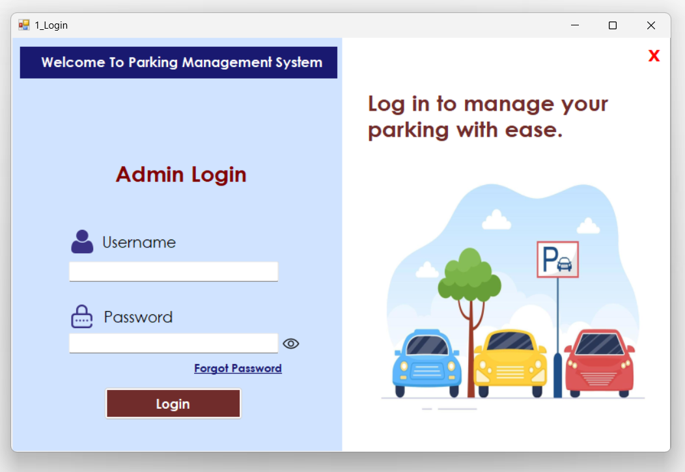
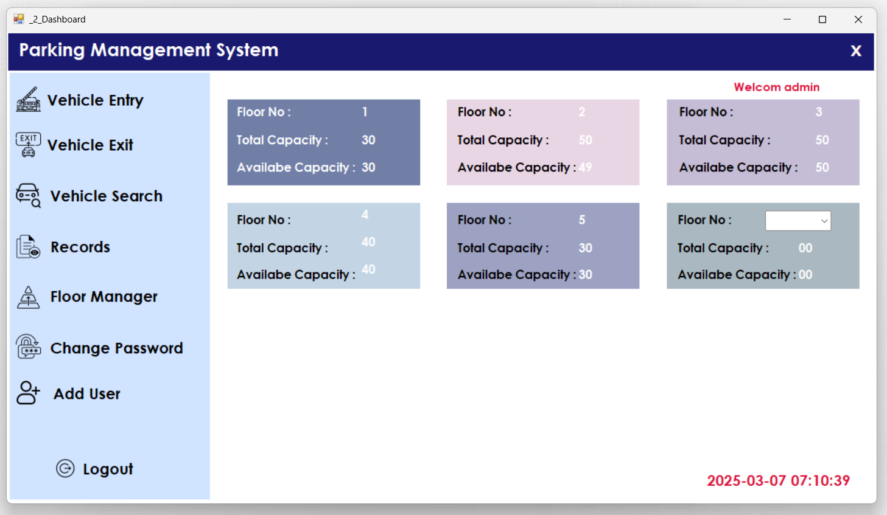

# Parking Management System (Offline)

## Overview
The **Parking Management System** (PMSF) is an offline application developed in **VB.NET** for efficiently managing parking spaces, vehicle entries/exits, and user authentication. It does not require an internet connection and provides a seamless parking management experience.

## Features
- **Admin Login**: Secure login for administrators.
- **Dashboard**: Overview of parking capacity and quick access to features.
- **Vehicle Entry**: Register incoming vehicles and allocate parking slots.
- **Entry Token**: Generate an entry token for parked vehicles.
- **Vehicle Search**: Search for vehicles in the parking system.
- **Vehicle Exit**: Process vehicle checkouts and free up space.
- **Parking Receipt**: Generate receipts for vehicle exits.
- **Floor Manager**: Manage parking floors and capacity.
- **Reset Password**: Admin and users can reset their passwords securely.
- **Add New User**: Admin can add new users to the system.

## Project Structure
```
├── Application Files
│   ├── Application.Designer.vb
│   ├── Application.myapp
│   ├── AssemblyInfo.vb
│   ├── Resources.Designer.vb
│   ├── Resources.resx
│   ├── Settings.Designer.vb
│   ├── Settings.settings
├── Forms
│   ├── 1_Login.vb
│   ├── 2_Dashboard.vb
│   ├── 3_VehicleEntry.vb
│   ├── 10_EntryToken.vb
│   ├── 6_VehicleSearch.vb
│   ├── 4_VehicleExit.vb
│   ├── 5_ParkingReceipt.vb
│   ├── 8_FloorManager.vb
│   ├── 9_ResetPassword.vb
│   ├── 11_AddUser.vb
├── Database
│   ├── PMSF.mdf
│   ├── PMSF_log.LDF
├── Solution Files
│   ├── PMSF.sln
│   ├── PMSF.vbproj
│   ├── App.config
│   ├── README.md
```

## Screenshots
Below are some screenshots of the system:

### 1. Login


### 2. Dashboard


### 3. Vehicle Entry


### 4. Entry Token


### 5. Vehicle Search


### 6. Vehicle Exit


### 7. Parking Receipt


### 8. Floor Manager


### 9. Reset Password


### 10. Add New User


## License
This project is licensed under the **MIT License**.

## Developed By
**Om Patel**  
📧 Email: patelom2810@gmail.com
